# TPO - Aplicaciones Interactivas - Teachers Market

# Tabla de Contenidos

1. [Introduccion](#introduccion)
2. [Requerimientos](#requerimientos)
3. [Instalacion](#instalacion)
4. [Funcionalidades](#funcionalidades)
5. [Documentacion](#documentacion)
6. [Documentacion de Postman](#documentacion-de-postman)
7. [Integrantes](#integrantes)

# Introduccion
Este proyecto es una página web llamada "Teachers Market", que se basa en conectar estudiantes y profesores particulares para la contratación de clases de diferentes materias. En la misma, también existe un sistema de calificación, puntuación y comentarios entre profesores y estudiantes. 
Los estudiantes podrán registrarse, buscar materias individuales, grupales, calificar una materia y/o a un profesor. Mientras que, por otro lado, los profesores tendrán la posibilidad de registrarse, crear nuevos cursos, aceptar estudiantes y comentarios recibidos sobre sus cursos dictados.
Esta página se realizó de forma didáctica con fines educativos para la materia de Aplicaciones Interctivas dictada en UADE durante el período de el 2do Cuatrimestre del 2022.

# Requerimientos
Los requerimientos para poder instalar y utilizar la aplicacion web son:

Lenguajes y librerías utilizadas en el frontend: HTML/CSS, React, JavaScript y NodeJS.

Lenguajes y librerías utilizadas en el backend: JavaScript , NodeJS y Mongoose.

Base de datos: NoSQL (MongoDB).

# Instalacion

## Instalación para el BackEnd
Una vez ubicado sobre el `root` de la carpeta, ejecutar los siguientes comandos:
```
$ npm install -g nodemon
$ nodemon app.js
```
Si la secuencia se ejecuta correctamente, debe aparecer esto en la terminal:


## Instalación para el FrontEnd
Una vez ubicado sobre el `root` de la carpeta, ejecutar los siguientes comandos:
```
$ npm install
$ npm start
```
Si la secuencia se ejecuta correctamente, se debe poder visualizar la página web desde el navegador:

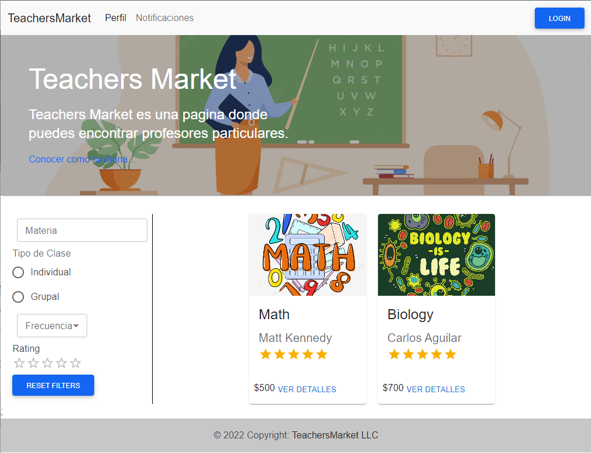

# Funcionalidades
En la página principal se pueden observar las materias que estan publicadas junto con su respectivo profesor, la calificación y el precio del curso.

También se puede realizar un filtrado por Materia, por tipo de clase (Individual o Grupal), por Frecuencia o por Calificación del curso.

Por otro lado, existe un link que dirige a la página de `Cómo Funciona` que es la sección donde se brinda información a los usuarios, acerca de las diferentes funcionalidades que tiene la página web.

Existe también el botón `LOGIN` que dirige a la página donde los usuarios pueden iniciar sesión o registrarse.

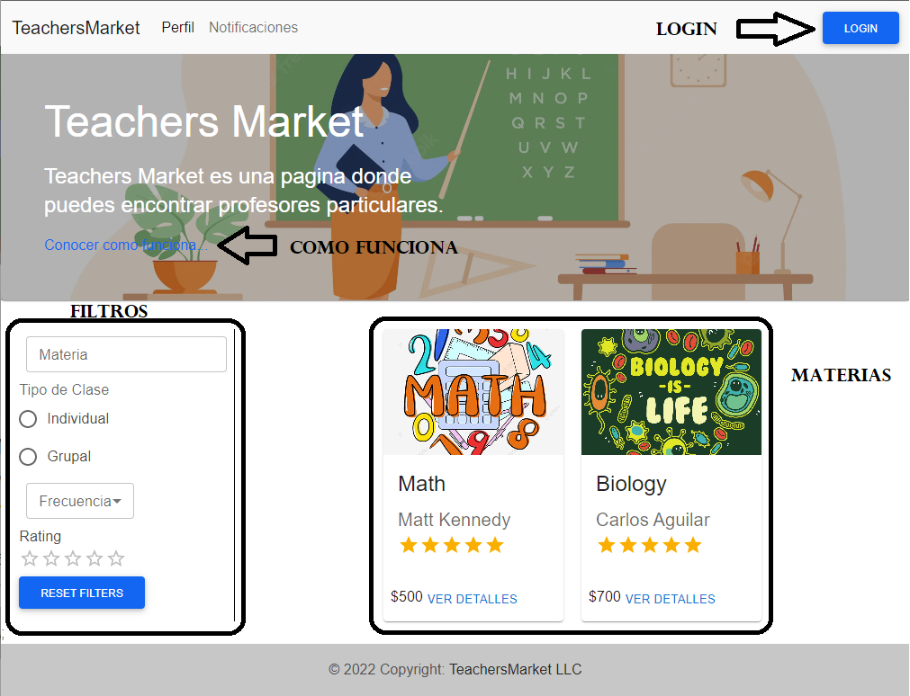

La sección `Cómo Funciona` muestra diferente información de acuerdo a si el usuario está o no logueado, y, a su vez, depende de qué tipo de usuario sea (Profesor o Estudiante).

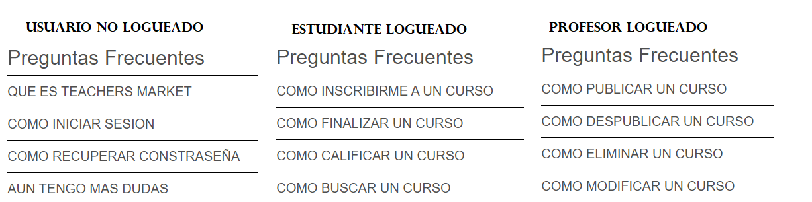

La sección de `LOGIN` muestra la pantalla de inicio de sesión o registro.

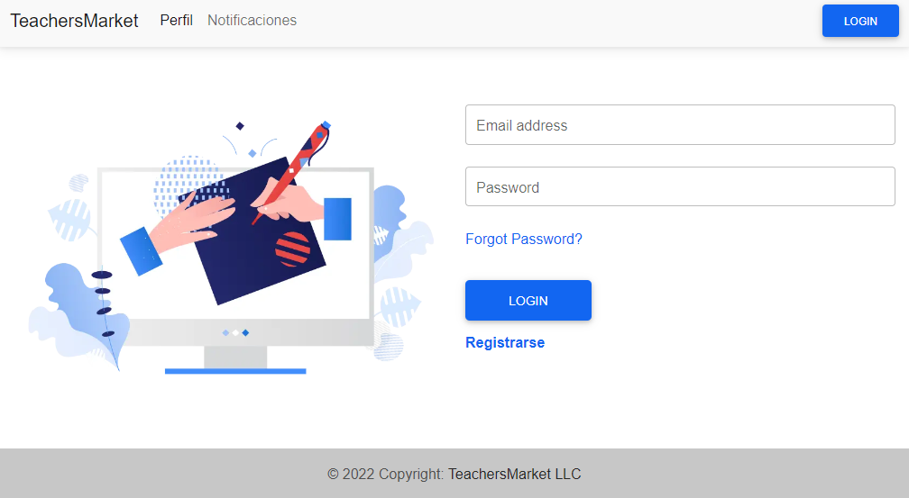

Si seleccionamos la opción de registrarnos, la página nos solicitará los datos de registro y que indiquemos si lo estamos haciendo en modalidad `Estudiante` o `Profesor`. Depende del tipo de registro, solicitará una información u otra.

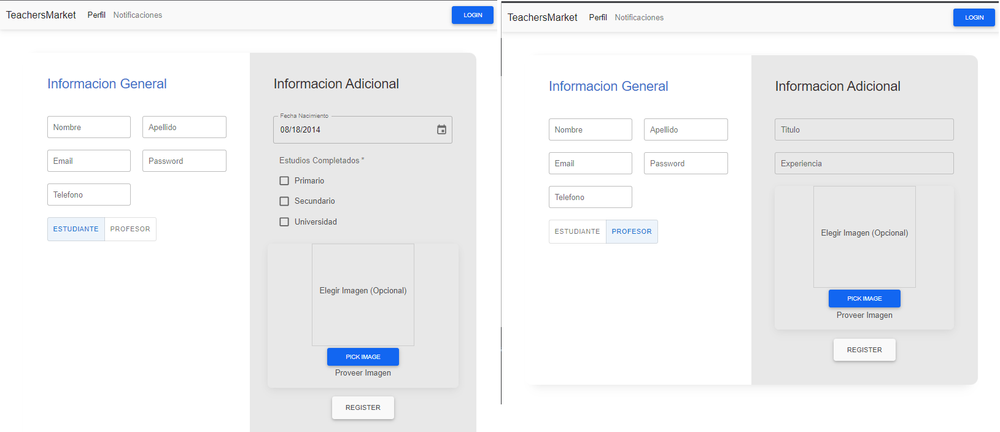

Una vez realizado el registro, podemos ir a la sección `Perfil` y visualizar los datos personales, o modificarlos si así se desea.

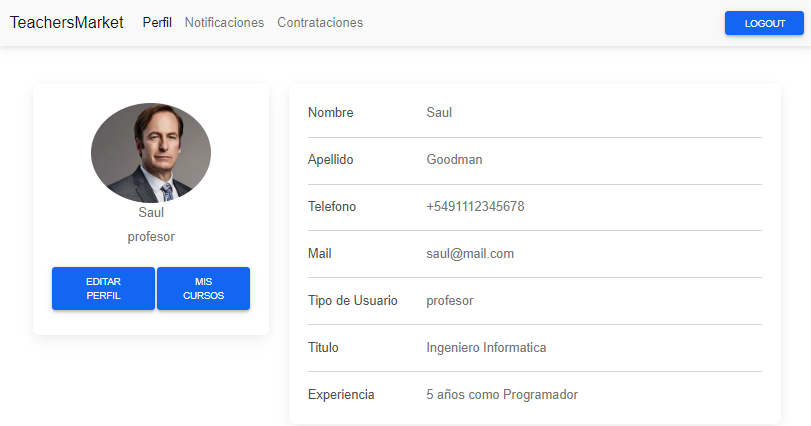

Como profesor, se puede crear cursos detallando el Nombre, Duración, Frecuencia, Tipo de Clase, Precio, Descripción y subir una imagen que represente a la materia.

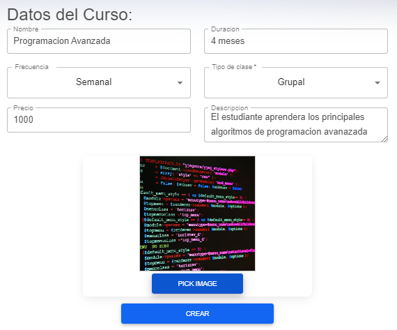

Una vez creado, el profesor puede ver el status del curso, lo puede eliminar, modificar o despublicar.

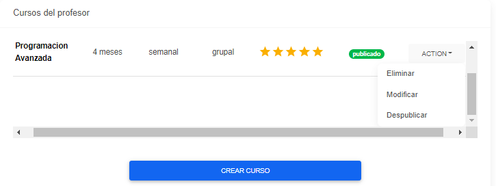

En el caso de los estudiantes, su perfil pueden ver los detalles del curso y solicitar inscribirse en ellos. Cuando lo solcita, se le pide completar cierta información como el teléfono, email, horario de contacto y el motivo de interés.

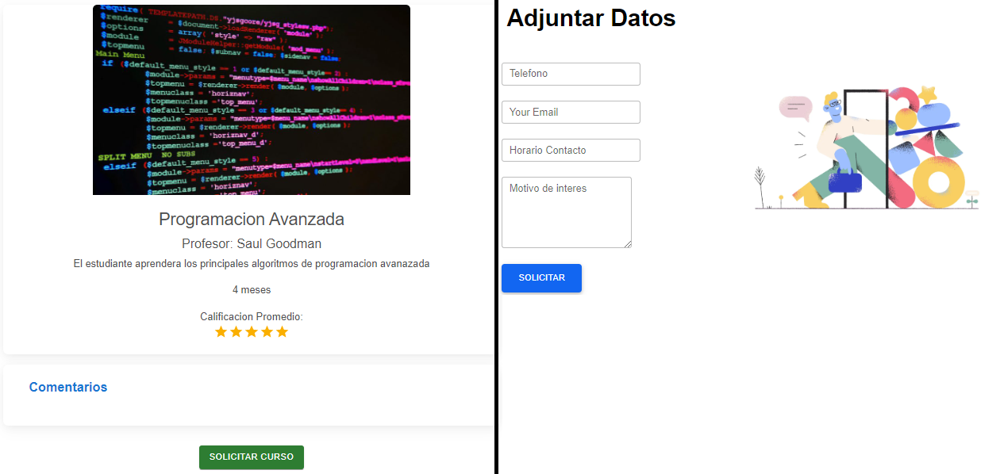

Una vez el estudiante realiza dicha solicitud, ésta es enviada al profesor para que pueda evaluar si la acepta o la rechaza.

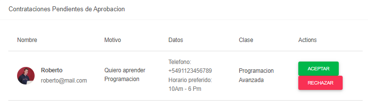

Si el estudiante es aceptado en un curso, podrá visualizar los cursos en los que esta inscripto y además, tendrá la opción de finalizarlo.

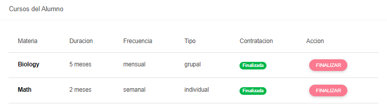

Y una vez el curso esté finalizado, el alumno va a poder dejar un comentario y calificarlo.

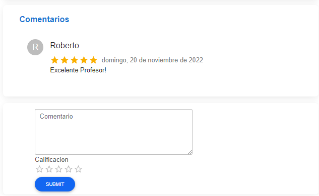

El estudiante también tendrá la opción de ver los comentarios que realizó anteriormente y podrá modificarlos o eliminarlos.

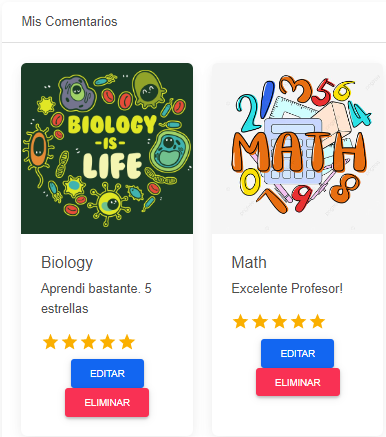

En caso de que el usuario necesite recuperar su contraseña, podrá hacerlo. Para ello, se le pedirá su mail y a continuación, recibirá un correo en su casilla con la opción para cambiar la contraseña.

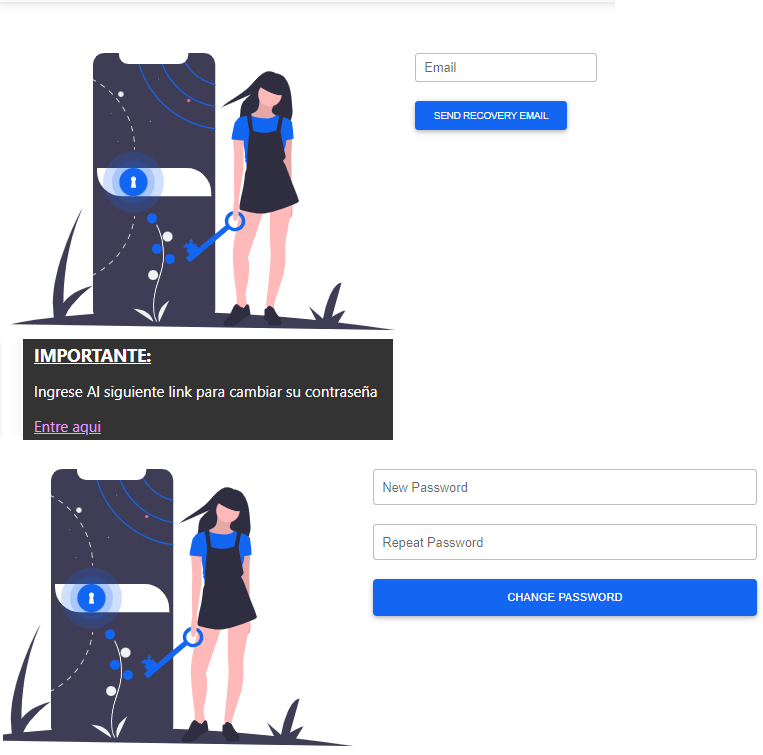

Y luego, el sistema mostrará un mensaje indicando que se ha cambiado la contraseña de forma existosa.

# Documentacion

Diagrama de estructura de la base de datos de MongoDB:

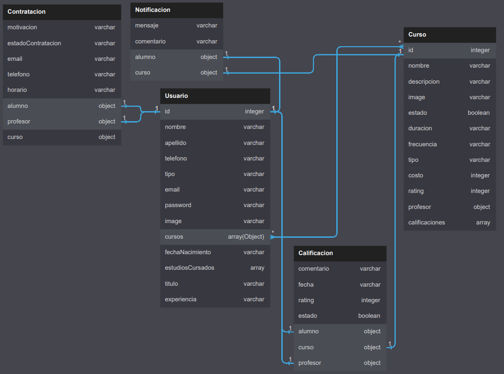


# Documentacion de Postman

https://documenter.getpostman.com/view/17356630/2s8YsnYwim

# Integrantes

## Roberto Salinas
## Diego Mosquera
## Iara Orosco
